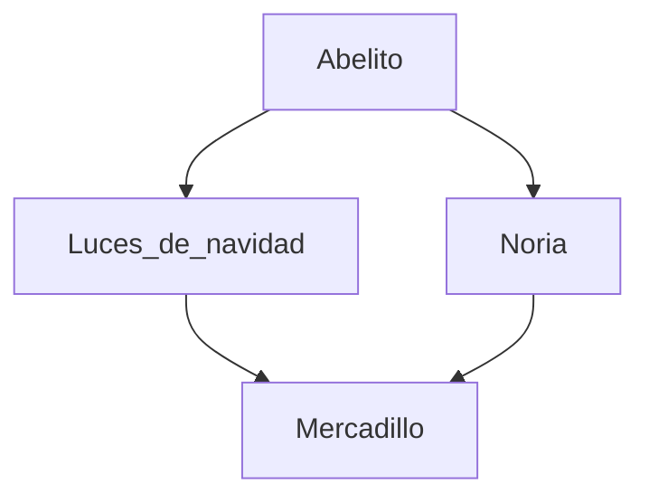

# Boletín 6
## Ficheros Android

Los siguientes ficheros fueron copiados de una aplicación de *Android Studio*. Realiza los DTD:

- `AndroidManifest.xml`: utilizado para la configuración de despliegue de la aplicación
- `extinguisher.svg`: icono de un extintor que puede usar la aplicación, si bien en Android es un tanto diferente los elementos, se usa este esquema. Instala una extensión en el Code para previsualizarlo, por ejemplo [esta](https://marketplace.visualstudio.com/items?itemName=jock.svg).
- `fragment_first.xml`: layout de la interface de usuario
- `themes.xml`: definición del tema (colores y formas) de la aplicación

:zap: :goat: :zap:

_**Texto en negrita y cursiva de prueba**_

Prueba de una cita
>Esto es una cita

Usa `git add .` para añadir tus archivos

Aqui estan mis repositorios (https://github.com/AlejandraDominguezCereijo)

:format(jpg)/f.elconfidencial.com%2Foriginal%2Fd29%2F9e2%2F373%2Fd299e2373be47b8c52fdef23736c3a99.jpg)

* Chandler bing

* Srt Chanandler bong

* Muriel

* Joey
  
  - No comparte su comida

  - Abracin es solo suyo

- [x] Ejercicio de SI
- [ ] Ejercios de COD
- [ ] Examen LMSXI

